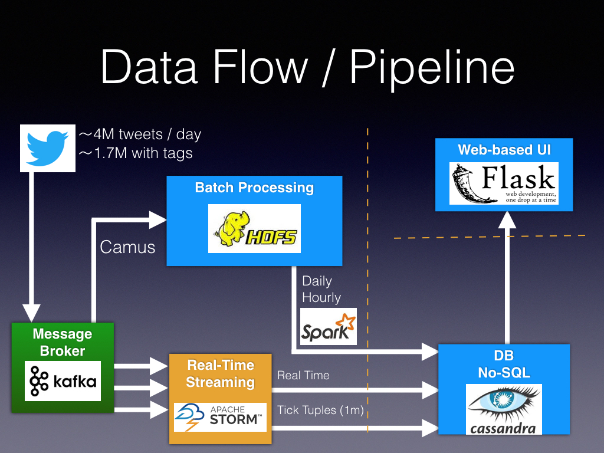

# TrendingTopics
An application that lets the user see what topics are trending at any location.
Trends are shown for real time as well as historically (hourly and daily).

The UI is available at www.TrendingTopics.info

The project implemented an end-to-end data pipeline using modern tools for big data on AWS.

# Technical Details
A few engineering details about the different components of the project.

## Pipeline

* The source of our data was the Twitter Streaming API.
* A topic is a #hashtag or a @user_mention

### Data Ingestion
A constantly running stream reader adds messages (each message is a JSON object representing one tweet) to the message broker, Kafka, at a rate of about 300MB/h. Kafka topic is configured with a partition value of 4 and replication factor of 2.

### Batch Processing
A Camus job runs twice an hour to store the messages to HDFS for batch processing.
Two Spark batch processes are configured:
* Hourly: Runs at the beginning of each hour and processes the tweets for the previous 3 hours (the overlap ensures a continuous coverage in case of a short maintenance downtime of the cluster/process) 
* Daily: Will move the files from their hourly locations to a daily (and permanent) storage. Aggregates the daily values for the application.

### Streaming
Storm is used for streaming. Kafka consumer is setup as a single spout, delivering the most recent tweets from the message broker.
There are two parts to the streaming process as well:
* Real Time bolt writes the following two types of data for each newly encountered tweet into our database:
  * Location: latitude and longitude
  * Tweet: The text and some basic information about a tweet
* Tick Tuples: Aggregate our data for the last minute.

### Database
Cassandra was chosen for it's high availability for quick writes. A cluster of 3 nodes manages the database.

### Web UI
I used Flask to display the data. This runs on a separate node of type t2.micro
